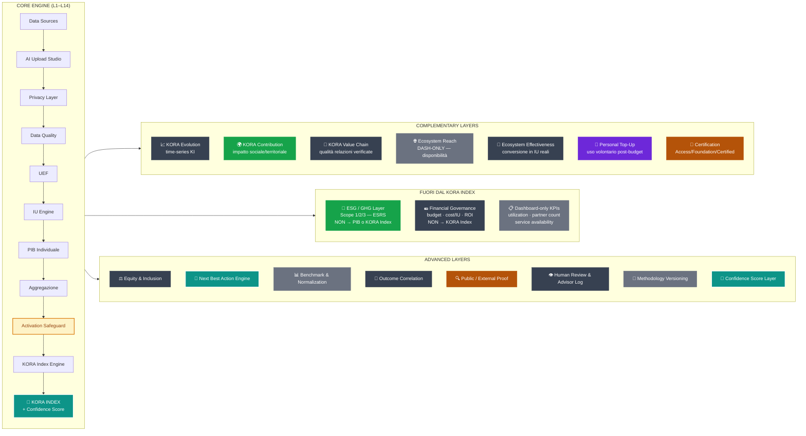
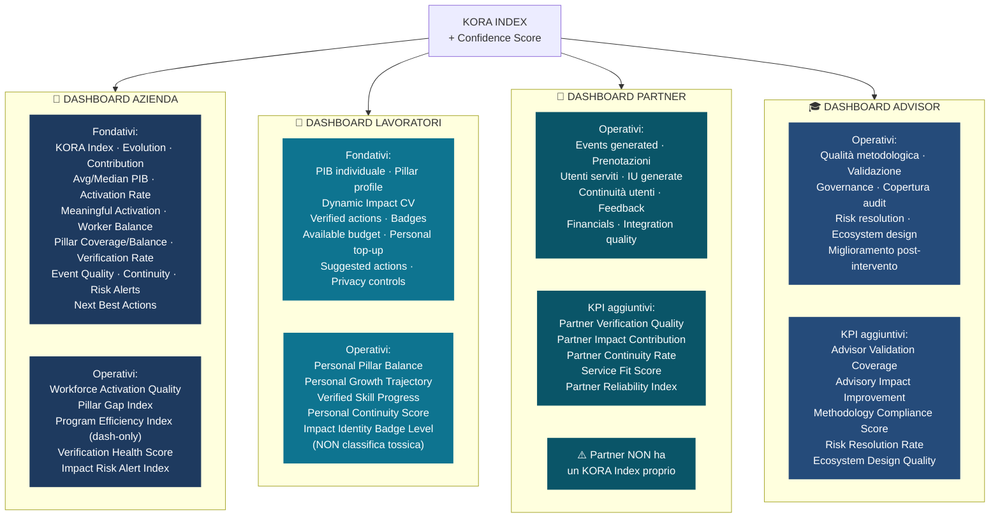

# KORA Architecture v3.0 — Specification Document
## Mermaid Diagrams · Governance Notes · Change Log · Layer Hierarchy

---

## PRINCIPIO FONDATIVO

> **KORA è una Impact Intelligence Platform.**
> Non una welfare platform. Non un marketplace. Non una dashboard HR. Non un ESG tool.
>
> *"Il KORA Index non è uno score di marketplace, non è uno score di budget, non è uno score di rete partner e non è uno score ambientale. È un indice di maturità people-impact costruito da azioni individuali verificate e dai PIB aggregati."*

**Actions are the unit.**

---

## DIAGRAMMA MERMAID 1 — Core Algorithm Flow

```mermaid
flowchart TB
  classDef core      fill:#1e3a5f,stroke:#1e3a5f,color:#fff
  classDef teal      fill:#0e7490,stroke:#0e7490,color:#fff
  classDef privacy   fill:#7c3aed,stroke:#7c3aed,color:#fff
  classDef quality   fill:#0a5568,stroke:#0a5568,color:#fff
  classDef uef       fill:#254b7a,stroke:#254b7a,color:#fff
  classDef engine    fill:#1e3a5f,stroke:#0d9488,stroke-width:2,color:#fff
  classDef safeguard fill:#fef3c7,stroke:#d97706,stroke-width:2,color:#92400e
  classDef index     fill:#0d9488,stroke:#fff,stroke-width:2,color:#fff
  classDef comp      fill:#374151,stroke:#374151,color:#fff

  subgraph DS["① DATA SOURCES"]
    direction LR
    KCP["Partner KCP\nKORA Link · palestre\npsicologi · enti formativi\nvolontariato · advisor"]
    EXT["Partner Esterni non KCP\nwelfare · LMS\nsanitari · associazioni"]
    INT["Dati Interni\nHR records · LMS\npayroll · CSR · KT"]
    WRK["Worker Actions\nbooking · check-in\ntop-up · co-payment"]
  end

  AI["② AI Upload Studio / Data Mapping\nCSV · API · Manual · event_type detection\nsource tier · confidence mapping · human review\n—\nAI suggerisce — non assegna score discrezionali"]

  PRV["③ Privacy & Data Sensitivity\npseudonymization · data minimization\nsensitive masking · no diagnosis\nrole-based access · privacy by design\n—\nKORA misura partecipazione verificata, non contenuti sensibili"]

  DQE["④ Data Quality Engine\nduplicate detection · missing data\nconfidence score · rejected rows\nanomaly check · data completeness"]

  UEF["⑤ UEF — Universal Event Format\nevent_id · worker_id pseudonymized · event_type\nsource tier · duration · evidence · privacy flag\ncompany / personal / co-payment · confidence"]

  NM["⑥ Normalized Magnitude\nNM = f(hours, event_type, cap)\nKORA non premia le ore in modo lineare.\nLe ore vengono normalizzate e cappate dove necessario."]

  BC["⑦ Base Contribution Vector\ndistribuzione sui 5 Pillars:\nLIFE · GROWTH · CONNECTION · IMPACT · LEGACY\n—\nBC non è un punteggio fisso: definisce dove l'evento contribuisce"]

  CF["⑧ Correction Factors\nCQ · EV · CF · AGF\n[DF] · [EXF] · [SF]"]

  AGF["⑨ Anti-Gaming & Anomaly Detection\ncaps by event type · diminishing returns\ndeduplication · concentration alerts\nAGF flags · advisor review\n—\nCaps + bassa verifica + bilanciamento\nriducono strutturalmente l'impatto del gaming"]

  IUE["⑩ Impact Unit Engine\nIU_{e,p} = NM × BC_{e,p} × CQ × EV × CF × AGF\n[× DF] [× EXF]"]

  PIB["⑪ PIB Individuale\nPIB_w = LIFE + GROWTH + CONNECTION + IMPACT + LEGACY\n—\nIl PIB è il bilancio individuale del lavoratore.\nInterpretabile e auditabile."]

  AGG["⑫ Aggregazione Aziendale\nCompany Total IU = Σ PIB\nAvg PIB · Median PIB · Gini\nDistribution · Pillar Totals\n—\nAverage PIB ≠ KORA Index"]

  ASF["⑬ ACTIVATION SAFEGUARD\nActivation Rate · Meaningful Activation Rate\nLow Activation Penalty · Ceiling Rule\n—\nL'alta qualità di pochi non può compensare\nuna bassa attivazione diffusa della popolazione.\nSoglie da calibrare empiricamente."]

  KIE["⑭ KORA INDEX ENGINE\nf(AR, MAR, NI, WB, PC, PB, EQ, VR, CO, CS)\nPesi da calibrare empiricamente"]

  KI["KORA INDEX\n+ Confidence Score\n[0-100]"]

  DS --> AI --> PRV --> DQE --> UEF
  UEF --> NM --> BC --> CF --> AGF --> IUE
  IUE --> PIB --> AGG --> ASF --> KIE --> KI

  class KCP,EXT,INT,WRK teal
  class AI teal
  class PRV privacy
  class DQE quality
  class UEF,NM,BC,CF uef
  class IUE,AGF engine
  class PIB,AGG core
  class ASF safeguard
  class KIE,KI index
```

---

## DIAGRAMMA MERMAID 2 — Extended Architecture (Layer Map)

---

## DIAGRAMMA MERMAID 3 — Stakeholder Dashboards

---

## LAYER HIERARCHY COMPLETA (23 layer)

| # | Layer | Tipo | → KORA Index? | Nota chiave |
|---|---|---|---|---|
| 1 | **Data Sources** | Input | No (precede) | KCP, Ext, Int, Worker, Financial, ESG |
| 2 | **AI Upload Studio / Data Mapping** | Processing | No (precede) | AI suggerisce — non assegna score |
| 3 | **Privacy & Data Sensitivity** | Governance | No (precede) | Pseudonymization, masking, no diagnosis |
| 4 | **Data Quality Engine** | Processing | No (precede) | Tecnico, distinto da anti-gaming |
| 5 | **UEF — Universal Event Format** | Normalization | No (precede) | Formato standard per ogni evento |
| 6 | **Normalized Magnitude** | Computation | Indirettamente | Ore normalizzate e cappate |
| 7 | **Base Contribution Vector** | Computation | Indirettamente | Distribuzione sui 5 Pillars |
| 8 | **Correction Factors** | Computation | Indirettamente | CQ, EV, CF, AGF, DF*, EXF*, SF* |
| 9 | **Anti-Gaming & Anomaly Detection** | Governance | Indirettamente (via AGF) | Strutturale, non solo rilevamento esplicito |
| 10 | **Impact Unit Engine** | Computation | Indirettamente (via PIB) | Formula: IU = NM × BC × CQ × EV × CF × AGF |
| 11 | **PIB Individuale** | Output Layer | Come input via NI | Obbligatorio — mai saltabile |
| 12 | **Aggregazione Aziendale** | Aggregation | Come input | Company Total IU = Σ PIB |
| 13 | **Activation Safeguard** | Governance | Sì (penalizza) | Bassa partecipazione non compensabile da alta qualità |
| 14 | **KORA Index Engine** | Index | **SÌ — è l'output** | f(AR, MAR, NI, WB, PC, PB, EQ, VR, CO, CS) |
| 15 | **Confidence Score** | Quality Signal | Con il KORA Index | Ogni KI ha confidence level |
| 16 | **KORA Evolution** | Analytics | No — time-series | Lettura temporale del KI |
| 17 | **KORA Contribution** | Complementary | **No** | Impatto sociale/territoriale — separato |
| 18 | **KORA Value Chain** | Complementary | **No** | Qualità relazioni verificate |
| 19 | **Ecosystem Reach** | Dashboard-only | **No** | Disponibilità ≠ impatto |
| 20 | **Ecosystem Effectiveness** | Complementary | Effetto indiretto | Conversione in IU reali |
| 21 | **Personal Top-Up Continuity** | Behavioral | **No** | Segnale di valore percepito, non impatto diretto |
| 22 | **Certification / Public Status** | Governance | No — dipende da KI | Non da singolo trimestre |
| 23 | **ESG / GHG / Sustainability** | Reporting | **No** | Metriche aziendali aggregate, non PIB |

Layer avanzati (trasversali):
- Financial Governance Layer → Dashboard/ROI — **No**
- Dashboard-only KPI Layer → Gestionale — **No**
- Equity & Inclusion Layer → Analytics — **No**
- Next Best Action Engine → Governance → Indiretto
- Outcome Correlation Layer → Research → **No** (correlazione, non causalità)
- Benchmark & Normalization → Future/Advanced → **No**
- Public / External Proof → Trust Layer → **No**
- Human Review & Advisor Log → Governance → Indiretto (via EV/CQ)
- Methodology Versioning → Infrastructure — **No**

---

## SLIDE-READY VERSION (8 blocchi principali)

### Blocco 1 — DATA SOURCES
**Input:** Partner KCP, Partner Esterni, Dati Interni, Worker Actions, Financial, ESG  
**Output:** Raw events da fonti eterogenee  
**Nota metodologica:** Non tutte le fonti hanno lo stesso peso — il source tier determina EV

### Blocco 2 — EVENT NORMALIZATION
**Input:** Raw events  
**Output:** UEF (Universal Event Format)  
**Include:** AI Upload Studio → Privacy Check → Data Quality → UEF  
**Nota metodologica:** AI suggerisce il mapping — Human Review approva. Non si assegnano score discrezionali.

### Blocco 3 — IMPACT UNIT ENGINE
**Input:** UEF normalizzato  
**Output:** IU per pillar per evento  
**Formula:** `IU_{e,p} = NM × BC_{e,p} × CQ × EV × CF × AGF [× DF] [× EXF]`  
**Nota metodologica:** BC non è un punteggio fisso — è una distribuzione sui 5 Pillars. Le ore vengono normalizzate, non conteggiate linearmente.

### Blocco 4 — PIB LAYER
**Input:** IU aggregate per worker  
**Output:** PIB_worker = [LIFE, GROWTH, CONNECTION, IMPACT, LEGACY]  
**Nota metodologica:** Il PIB è il bilancio individuale del lavoratore. È interpretabile, auditabile e privato. È il passaggio obbligatorio — non saltabile.

### Blocco 5 — ACTIVATION SAFEGUARD
**Input:** Distribuzione dei PIB  
**Output:** Activation Rate, Meaningful Activation, Penalty  
**Nota metodologica:** L'alta qualità di pochi lavoratori non può compensare integralmente una bassa attivazione diffusa. Soglie da calibrare empiricamente.

### Blocco 6 — KORA INDEX ENGINE
**Input:** Distribuzione PIB + componenti aggregate  
**Output:** KORA Index [0–100] + Confidence Score  
**Formula concettuale:** `f(AR, MAR, NI, WB, PC, PB, EQ, VR, CO, CS)`  
**Nota metodologica:** Pesi da calibrare empiricamente. Average PIB ≠ KORA Index.

### Blocco 7 — COMPLEMENTARY LAYERS
**Include:**
- KORA Evolution (time-series)
- KORA Contribution (impatto sociale — separato)
- KORA Value Chain (qualità relazioni)
- Ecosystem Reach (dashboard-only — disponibilità ≠ impatto)
- Personal Top-Up Continuity (valore percepito)
- ESG/GHG Layer (reporting — non → KORA Index)
- Financial Governance (ROI — non → KORA Index)

**Nota metodologica:** Non tutto ciò che è in dashboard entra nel KORA Index. Questa separazione è un punto di forza metodologico.

### Blocco 8 — STAKEHOLDER DASHBOARDS
**Azienda:** KORA Index + 5 indicatori operativi  
**Lavoratori:** PIB + Dynamic Impact CV + 5 indicatori personali  
**Partner:** KPI operativi (NON KORA Index proprio)  
**Advisor:** Qualità metodologica + 5 indicatori di governance

---

## LEGENDA COLORI

| Elemento | Colore | Hex |
|---|---|---|
| Core algorithm pipeline | Navy / Deep blue | `#1e3a5f` |
| Data Integration / AI Upload | Teal | `#0e7490` |
| Privacy Layer | Purple | `#7c3aed` |
| Data Quality | Dark teal | `#0a5568` |
| IU Engine + Index output | Mint / Green | `#0d9488` |
| KORA Index output | Mint + gold border | `#0d9488` |
| Activation Safeguard | Amber (warning) | `#d97706` |
| Complementary outputs | Gray | `#374151` |
| ESG / Sustainability | Green | `#16a34a` |
| Financial Governance | Dark gray | `#374151` |
| Dashboard-only | Neutral gray | `#6b7280` |
| Certification / Public Proof | Gold | `#b45309` |
| Personal Top-Up | Violet | `#6d28d9` |
| Partner / Advisor layers | Slate cyan | `#4b5563` |
| PILLAR LIFE | Red | `#dc2626` |
| PILLAR GROWTH | Blue | `#2563eb` |
| PILLAR CONNECTION | Violet | `#7c3aed` |
| PILLAR IMPACT | Green | `#16a34a` |
| PILLAR LEGACY | Amber | `#d97706` |
| Excluded from KORA Index | Red alert bg | `#fef2f2` / `#dc2626` |

---

## CHANGE LOG — v2 → v3

| Area | Modifica | Motivazione |
|---|---|---|
| **Activation Safeguard** | Nuovo blocco obbligatorio tra Aggregazione e KORA Index Engine | Stress test: scenario B (bassa partecipazione, alta qualità) mostrava KORA Index invariato — corretto |
| **Privacy Layer** | Layer esplicito dedicato, separato da Data Quality | Separazione concettuale: qualità tecnica ≠ sensibilità del dato |
| **Ecosystem Reach** | Rinominato chiaramente come "disponibilità, non impatto" — Dashboard-only | Evitare confusione con KORA Index |
| **Ecosystem Effectiveness** | Nuovo indicatore: conversione ecosistema in IU reali | Misura ciò che Ecosystem Reach non misura |
| **Personal Top-Up Continuity** | Rinominato (era "Ecosystem Activation") — separato con definizione precisa | Corretto naming + chiarificazione: segnale di valore percepito, non impatto |
| **KORA Value Chain** | Separato da Ecosystem — definizione: qualità relazioni verificate | Non ridurre a conteggio partner |
| **Confidence Score** | Layer dedicato — non solo nota | Ogni KI deve avere Confidence Level esplicito |
| **Next Best Action Engine** | Nuovo layer — trasforma misurazione in governance | KORA non è solo misurazione passiva |
| **Equity & Inclusion Layer** | Nuovo — misura chi resta fuori | Equità = accesso all'impatto, non solo quantità |
| **Outcome Correlation Layer** | Nuovo — con disclaimer causalità | Correlazione ≠ causalità prima di validazione longitudinale |
| **Benchmark & Normalization** | Esplicitato come advanced/future layer | Comparabilità ≠ naïve comparabilità |
| **Methodology Versioning** | Layer infrastrutturale esplicito | Ogni calcolo deve citare la versione |
| **Human Review Audit Log** | Separato e formalizzato | Advisor può validare/respingere — non aumentare arbitrariamente |
| **Financial Governance** | Layer separato esplicitato | Budget/ROI — mai nel KORA Index |
| **ESG/GHG** | Separazione netta: azioni individuali → IU_IMPACT; metriche aziendali → Reporting Layer | Impedisce confusione metodologica |
| **Partner dashboard** | Specificato: Partner NON ha KORA Index proprio | KPI operativi, non indice people-impact |
| **BCM** | Nota esplicita: BC non è punteggio fisso | È una distribuzione sui 5 Pillars |
| **NM** | Nota esplicita: ore normalizzate e cappate | Non crescita lineare |
| **Classificazione KPI** | 4 categorie formali: Fondativi / Complementari / Dashboard-only / Stakeholder-specific | Chiarezza architetturale |

---

## ALGORITHM GOVERNANCE NOTES

**AG-01:** Ogni calcolo KORA deve passare per i PIB individuali. Non è consentito calcolare il KORA Index direttamente da dati aggregati aziendali.

**AG-02:** La formula IU è pubblica e versionata. Nessun black box.

**AG-03:** I pesi del KORA Index sono prior teorici — dichiarati come "to be empirically calibrated" in ogni documento.

**AG-04:** L'Activation Safeguard deve essere calibrato empiricamente. Le soglie attuali sono provvisorie.

**AG-05:** Ogni KORA Index ha un Confidence Score. Due aziende con stesso KORA Index ma diversa confidence sono metodologicamente diverse.

**AG-06:** Il sistema anti-gaming è strutturale, non solo rilevamento esplicito. Caps + bassa verifica + bilanciamento riducono l'impatto del gaming senza necessità di detection caso per caso.

**AG-07:** KORA non dichiara causalità con outcome aziendali prima di una validazione longitudinale.

**AG-08:** Human Review può validare o respingere evidenze — non può aumentare arbitrariamente gli score.

---

## DATA GOVERNANCE NOTES

**DG-01:** Ogni calcolo riporta: algorithm version, BCM version, NM rules version, correction factors version, KORA Index weights version.

**DG-02:** Se la metodologia cambia, gli score storici devono restare tracciabili con la versione metodologica usata.

**DG-03:** Ogni IU è riconducibile all'evento originale, al worker pseudonymized, alla fonte.

**DG-04:** Il Data Quality Engine verifica affidabilità tecnica del dato — è separato dall'anti-gaming layer.

**DG-05:** Ogni evento rifiutato ha rejection_reason documentato nell'audit trail.

**DG-06:** Ogni intervento dell'advisor ha: advisor ID, timestamp, reason code, before/after status.

---

## PRIVACY NOTES

**PR-01:** Pseudonymization al momento dell'ingestion — non a posteriori.

**PR-02:** Diagnosi, contenuti psicologici, note mediche: mai visibili all'azienda.

**PR-03:** L'azienda vede aggregati — non contenuti personali sensibili.

**PR-04:** KORA misura partecipazione verificata, non contenuti personali sensibili.

**PR-05:** Legal basis per ogni tipo di dato — documentata nell'UEF.

**PR-06:** Dati sensibili per analisi di equità (genere, età, disabilità) solo se legalmente e eticamente consentito.

---

## METHODOLOGY VERSIONING NOTES

**MV-01:** BCM v1.0 è una prior teorica soggetta a Delphi Study (Fase 1 della roadmap di validazione).

**MV-02:** Tutti i parametri correnti sono "pre-empirical calibration" — mai presentati come definitivi.

**MV-03:** Roadmap di validazione: stress test simulato → pilot reale → Delphi Study BCM → calibrazione statistica pesi → benchmark settoriali → validazione accademica → audit metodologico → algoritmo v1.0.

**MV-04:** Ogni release della metodologia ha change log pubblico e versione numerata.

---

## WHAT MUST NOT BE INCLUDED IN THE KORA INDEX

| Elemento escluso | Perché |
|---|---|
| Budget disponibile / speso | Misura input economico, non output comportamentale |
| Numero partner disponibili | Misura disponibilità offerta, non utilizzo o impatto |
| KORA Ecosystem Reach | Disponibilità ≠ impatto — dashboard separata |
| GHG / Scope 1-2-3 | Metriche ambientali aziendali — ESG Reporting Layer |
| Numero grezzo di eventi | Quantità senza qualità è manipolabile |
| Marketplace size / catalogo | Amplezza offerta non genera automaticamente PIB |
| Engagement superficiale | Survey non verificate, comunicazione interna |
| Disponibilità teorica servizi | Un servizio disponibile ma non usato = PIB zero |
| Partner network score | La rete misura capacità potenziale, non impatto reale |
| Budget per lavoratore | Correlato con spesa, non con azioni e Impact Units |
| Utilization rate servizi | Indicatore di efficienza, non di impatto |
| Reporting readiness | Preparazione al reporting, non impatto |
| Advisor network size | Governance, non output comportamentale |

---

*KORA Architecture v3.0 — Technical Specification*
*Methodology Reference · Standard-ready · Pre-empirical calibration*
